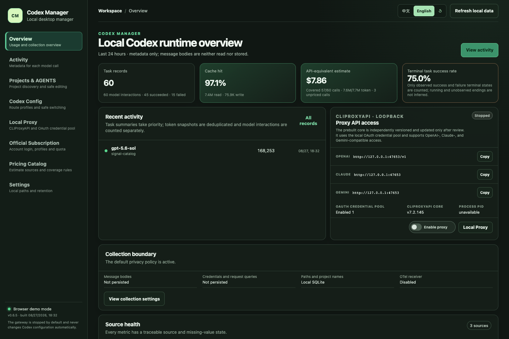
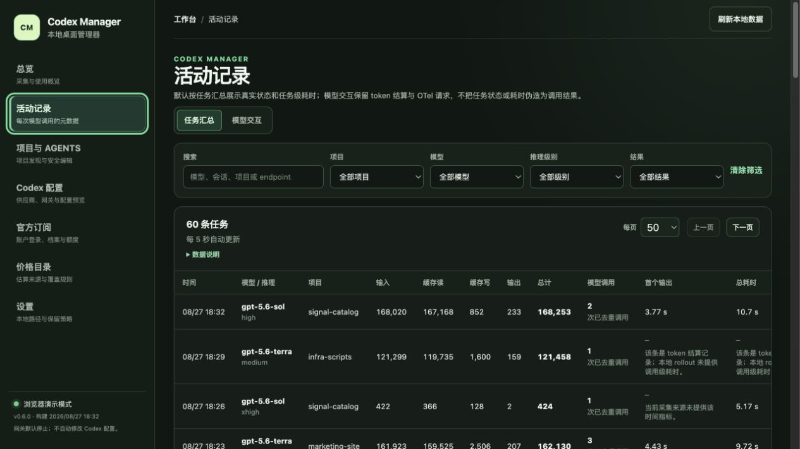
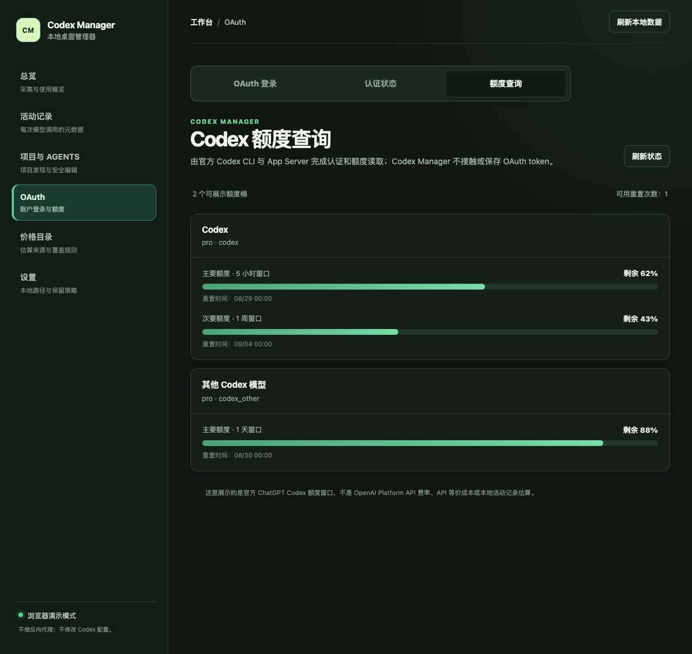
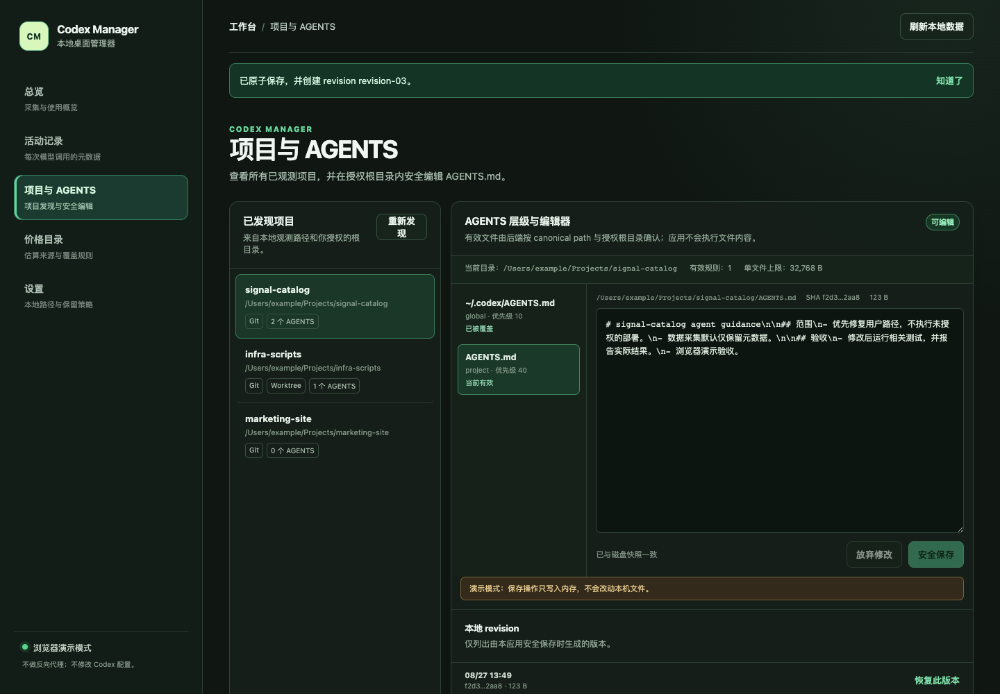
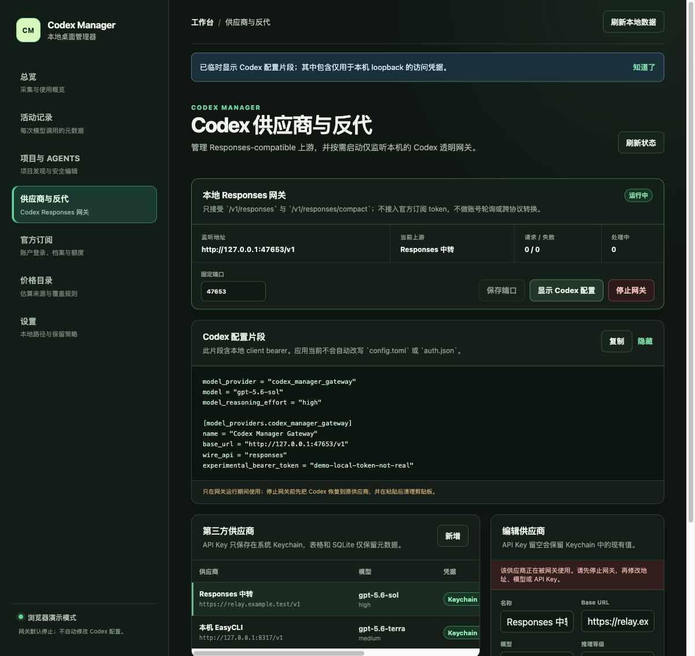
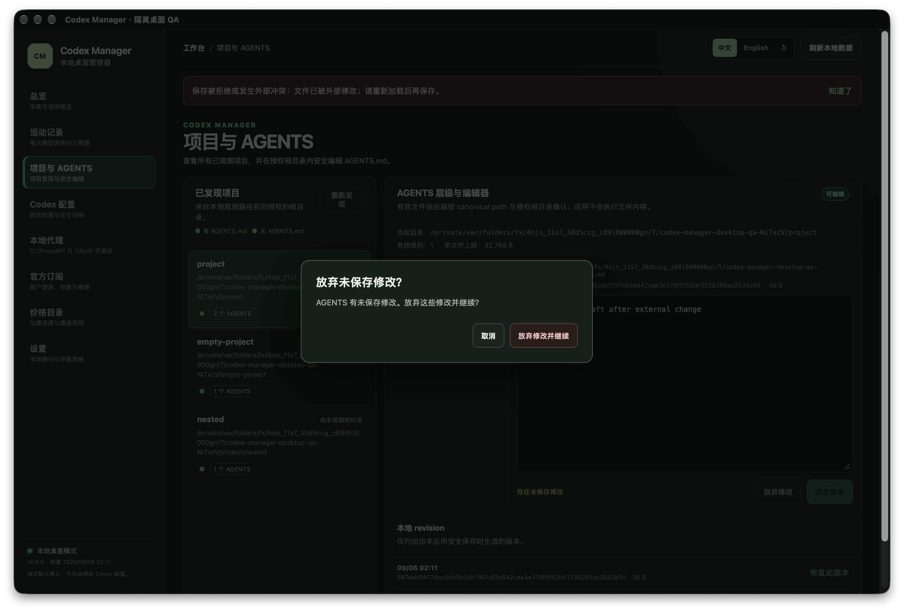

# Codex Manager

**English** | [简体中文](README.zh-CN.md)

> Your local control center for OpenAI Codex.

Codex Manager is an unofficial, local-first desktop app for understanding and managing Codex usage on your own machine: sessions, models, reasoning effort, tokens, accounts, providers, projects, and `AGENTS.md` files in one place.

[](https://github.com/ewsun22/codex-manager/releases/latest) [](https://github.com/ewsun22/codex-manager/actions/workflows/ci.yml) [](https://github.com/ewsun22/codex-manager/releases/latest) [](https://tauri.app/) [](https://www.rust-lang.org/) [](LICENSE)

**[Download for macOS (Apple silicon) →](https://github.com/ewsun22/codex-manager/releases/latest)**



## Download

**[Download the latest signed macOS release](https://github.com/ewsun22/codex-manager/releases/latest)** · [Release assets and checksums](https://github.com/ewsun22/codex-manager/releases/latest) · [All releases](https://github.com/ewsun22/codex-manager/releases)

The latest non-draft, non-prerelease GitHub Release is the stable macOS arm64 download source of truth. Each version must independently pass Developer ID signing, Apple notarization, stapling, and public asset verification; verify its published assets and checksums when your workflow requires it.

If Codex Manager makes your workflow easier, consider starring the repository to follow future releases.

**Known issue in v0.6.6:** upgrading a database near 512 MiB can fail at migration 14 and prevent startup. The v0.6.7 source fixes this with a fixed 1 GiB database budget. Existing databases must not be deleted as a workaround. See [diagnosis and validation](docs/validation/startup-migration-capacity.md).

## Why Codex Manager?

As Codex usage grows, useful context is spread across the CLI, local rollout files, configuration, account state, and project instructions. It becomes difficult to answer which model and reasoning effort a task used, how many tokens were observed, which projects have an `AGENTS.md`, and which account or provider is active.

Codex Manager brings those views into a single local desktop control center. Observed data is labeled by source, missing values remain `unavailable`, and estimates are not presented as provider bills.

## Features

### Observe

- Browse sessions, turns, model interactions, models, providers, reasoning effort, timing, and available token categories.
- Inspect input, output, cached read/write, and reasoning output tokens with source/provenance.
- Filter and cursor-page activity; open detail views without persisting message or reasoning text.
- Estimate API-equivalent cost from a versioned pricing catalog. This is not ChatGPT subscription billing or a provider invoice.
- The overview uses a compact layout with one recent-activity row; the homepage API-equivalent estimate is rounded to two decimal places while coverage semantics remain unchanged.

### Manage

- Read Codex `sessions` and `archived_sessions` incrementally and normalize them into local SQLite.
- Discover observed projects, Git roots, worktrees, and the effective `AGENTS.md` chain.
- Create, edit, save, restore, and review project `AGENTS.md` revisions only inside an explicitly authorized root.
- Use the official Codex login/App Server boundary for account, plan, quota windows, and reset times; macOS beta supports multiple imported OAuth profiles with explicit switching.
- Official subscription data is cache-first after the first successful read; a manual Refresh action forces a live read and the UI labels cache age and last-confirmed state.
- Use the separate **Codex configuration** page to switch among official direct, local CLIProxyAPI, and saved external Responses-compatible providers with preview, CAS/atomic apply, and restore.
- Use the separate **Local proxy** page to import and manage a CLIProxyAPI OAuth profile pool, then expose the local loopback endpoint to Codex. External API-key providers remain a Codex configuration concern and do not pass through CLIProxyAPI.

### Local-first

- Default storage is local SQLite; there is no product telemetry or cloud sync.
- Official and CLIProxyAPI OAuth secrets remain in separate application-specific Keychain domains; provider API keys stay in Keychain and are used by the Codex configuration path.
- Optional OTel receiver and CLIProxyAPI core are disabled until the user enables them and bind only to local interfaces.
- User actions are explicit: the app does not silently rewrite Codex configuration or rotate accounts in the background.

## Quick Start

1. Download the latest macOS `.dmg` from [Releases](https://github.com/ewsun22/codex-manager/releases/latest).
2. Install and launch **Codex Manager**.
3. On first launch, it discovers available local Codex data under the configured Codex home (normally `~/.codex`).
4. Open the activity view to inspect observed sessions and model usage.
5. To edit an `AGENTS.md`, first authorize the project root in Settings. To use the local proxy, import a CLIProxyAPI-compatible OAuth profile and explicitly enable it on the overview. The first enable downloads and verifies the reviewed prebuilt CLIProxyAPI baseline for the current platform; Codex Manager never builds the Go core locally.

Codex configuration changes are explicit and transactional; the app does not edit `auth.json`. The signed release includes Developer ID signing, Apple notarization, and stapling; account switching and proxy use still require explicit user actions.

## Screenshots

All screenshots use synthetic, sanitized demo data.

| Activity and token usage | Accounts and quota |
| --- | --- |
|  |  |

| Projects and `AGENTS.md` | Custom Responses providers |
| --- | --- |
|  |  |

## v0.6.7 upgrade startup fix

Version 0.6.7 increases the fixed SQLite database budget from 512 MiB to 1 GiB and calculates the page limit from the actual page size. This lets the observed near-limit v13 database create the migration-14 index without deleting existing data. Capacity regression tests and migration of a private copy passed; installing the fixed build and verifying startup on the user’s machine remain user-operated and unaccepted. See the [v0.6.7 release notes](docs/release-notes/v0.6.7.md).

## Previous v0.6.6 reliability improvements

The v0.6.6 source includes the following reliability fixes. The stable download is the latest verified public Release; source versioning alone does not indicate publication.

- Task totals remain `unavailable` after an invalid token snapshot; earlier valid calls still contribute to explicitly partial API-equivalent estimates. Missing call metadata uses the same fallback for activity and pricing across incremental batches.
- Retention also applies during initial import, rebuild and scheduled maintenance. Tasks without an observed terminal state or a usable timestamp are retained; source rollout files and credentials are unaffected.
- AGENTS editing protects unsaved changes and rejects stale read results. Activity filter choices cover the selected view's full history. Write success and a subsequent refresh failure are reported separately.
- Local proxy status refreshes while its page is visible. Slow native work runs off the UI thread, and proxy startup health checks have a bounded deadline.

- Changed rollout files receive priority within bounded queues; background discovery resumes across scan budgets so older files remain reachable.
- In-app confirmations protect unsaved AGENTS edits, AGENTS creation/restoration, Codex configuration changes and local proxy OAuth profile removal in the desktop WebView.

Implementation and validation boundaries are recorded in the [v0.6.6 release notes](docs/release-notes/v0.6.6.md).

The v0.6.6 source in an isolated debug desktop, using synthetic data; this is a validation screenshot, not a claim of signed-package installation.



## Supported platforms

- **Supported:** macOS 13+, arm64 release artifacts.
- **Windows:** unavailable; no equivalent supported secret-store and file-safety implementation is claimed.
- **Linux:** unavailable; no equivalent supported secret-store and file-safety implementation is claimed.

Core collection, normalization, storage, pricing, and project parsing are kept behind cross-platform interfaces, but that is not a claim of current Windows or Linux support.

## How it works

Codex Manager uses adapters rather than exposing private source formats directly to the UI:

- **Rollout adapter:** incrementally reads local `sessions` and `archived_sessions` JSONL. It records metadata, not message bodies. Token snapshots are deduplicated by session, ordinal, event type, and cumulative vector; they are not blindly summed.
- **OTel adapter:** optional authenticated OTLP/HTTP on local TLS loopback. It can provide request status, duration, and bounded classifications. Current Codex metrics do not reliably identify a conversation, so the app does not invent request-to-session joins.
- **CLI Schema compatibility:** a short-lived probe verifies whether the local CLI supports the App Server Schema. It is not a collection source, does not attach to Codex Desktop's private stdio, and does not affect rollout collection; the latest probe is persisted.
- **Official App Server adapter:** separate short-lived, bounded reads provide account, plan, and ChatGPT Codex quota data. It does not attach to Codex Desktop's private stdio or read historical data.
- **Filesystem and AGENTS adapter:** discovers observed cwd and explicitly authorized roots, resolves the effective chain, and uses canonical-path, no-follow, conflict-check, and atomic replacement protections for writes.

## Observability and data boundaries

Every metric carries a source or confidence boundary. `unavailable` means that the source did not provide a verifiable field; it is not zero. `unobserved` means a reliable terminal state was not available; it is not a success, failure, or proof of still running.

Rollout metadata is an internal compatibility source, not a stable public API. OTel `codex.api_request` events can add request status, duration, and fixed provider/origin/route classifications, but raw hosts, paths, query strings, and bodies are not stored. Native Codex telemetry usually does not provide reliable wire response bytes or request-level TTFB. The activity view therefore does not claim all requests, strict real-time completeness, or a complete provider bill.

API-equivalent pricing uses recognized model calls and the versioned local catalog. Unknown models and incomplete fields stay uncovered; the result is not ChatGPT subscription cost, OpenAI Platform billing, or a third-party provider invoice.

See the [capability matrix](docs/capability-matrix.md) and [architecture](docs/architecture.md) for field-level semantics and limits.

## Accounts, providers, and the local gateway

Official Codex subscription access remains in the trusted `codex login`, App Server, official credential store, and explicit account-switching path. Official OAuth access/refresh tokens never enter CLIProxyAPI. The three trust domains—Codex config orchestration, official Codex OAuth, and CLIProxyAPI OAuth—exchange only opaque profile IDs and status.

Imported-profile switching is explicit and is supported only when Codex resolves `cli_auth_credentials_store` to `file`; `keyring` and `auto` modes fail closed. Because the CLI and IDE extension share the active credential file, finish running Codex tasks before switching accounts.

The optional local proxy is an independently versioned, prebuilt [CLIProxyAPI](https://github.com/router-for-me/CLIProxyAPI) sidecar. Codex Manager does not compile or embed its Go source. The overview provides an explicit switch, OpenAI/Claude/Gemini-compatible endpoint labels, core version, and PID:

- Stopped by default; generated configuration forces `127.0.0.1`, disables remote management, the control panel, plugins, usage statistics, and request logging, and enables CLIProxyAPI commercial mode so error middleware does not log request bodies.
- The desktop app and CLIProxyAPI have independent versions. The current internal-test baseline pins official CLIProxyAPI `v7.2.145` asset names and exact SHA-256 values in code; it downloads only the matching official tag asset after an explicit user action and does not follow upstream `latest`. Extraction is bounded and staged, while an already installed core remains available until the reviewed baseline passes its health check.
- The local proxy supports a user-imported CLIProxyAPI OAuth credential pool (`codex`, `claude`, `antigravity`, `kimi`, `xai`). OAuth files are selected only by the native picker and stored in a separate Keychain service; Management API and OAuth callback are not exposed to the WebView. External API-key providers are configured directly in Codex configuration.
- The local sidecar no longer accepts arbitrary remote Base URLs, so the former redirect/DNS/IP gate is removed from this path. External endpoints and API keys remain in Codex configuration and are used directly by Codex.
- OAuth profiles are projected into a random `0700` auth-dir with `0600` files. On normal stop, provider/identity/CAS checkpoint runs before cleanup; interrupted-process recovery remains defensive behavior, but perfect cross-process recovery is not an internal-test release gate.
- Each start uses a random runtime session and rejects an already occupied loopback port. A normal stop reaps the owned child and removes the session; a macOS hard kill can still leave the child alive, so the next launch rejects the occupied port instead of killing an unverified PID. Cross-restart ownership recovery is a later improvement, not an internal-test release gate.
- The overview never displays the bearer or provider API key.
- The Codex configuration page uses official `model_providers.<id>.auth.command`; config stores only the app binary path and allowlisted opaque secret reference. A private journal enables restore and rejects external file drift. `verified` means post-write file recheck only, not a successful upstream request.

The local proxy is intentionally limited to the CLIProxyAPI OAuth pool. External API-key Base URLs are handled by the Codex configuration path; the sidecar is not a general-purpose outbound proxy.

Official subscription views are cache-first: after the first successful read, a whitelist-only account summary, plan, quota windows, and timestamps are kept in the separate macOS Keychain cache. Later visits read that cache before resolving the trusted CLI; Refresh is the explicit live-read action. Tokens, raw JSON, authorization URLs, and error bodies are not cached.

The Codex configuration page focuses on provider routes, preview, apply, and restore; the unopened “Global prompts”, “Plugins and marketplace”, and “Session management” placeholder modules have been removed. The sidebar’s local desktop mode shows the application version and build time (optionally a short SHA), sourced from build metadata rather than launch time.

## Security and privacy

- Local-first by default: no product telemetry, cloud sync, or automatic upload of Codex messages, projects, or settings.
- Message bodies, prompts, reasoning text, tool arguments/results, `Authorization`, cookies, OAuth codes, access/refresh tokens, full environment variables, request queries, and raw OAuth/App Server responses are not persisted. The explicit runtime exception is credential material required by CLIProxyAPI in its private mode-`0600` files while the sidecar runs.
- OAuth profile secrets are verified in bounded native flows and stored in application-specific macOS Keychain; normal SQLite/WebView DTOs expose only non-secret metadata.
- OTel and CLIProxyAPI listeners are opt-in, authenticated, and local. The generated CLIProxyAPI configuration is fail-closed and does not expose its Management or OAuth control plane.
- AGENTS writes require an authorized root, canonical path and symlink checks, external-change detection, and atomic replacement. Revisions contain user-authored AGENTS text and are retained separately.
- Release CI includes pinned actions, secret scanning, SBOM/license output, artifact hashes, and a protected signing workflow.

Read [SECURITY.md](SECURITY.md), [PRIVACY.md](PRIVACY.md), [supply-chain notes](docs/supply-chain.md), the [capability matrix](docs/capability-matrix.md), and [architecture](docs/architecture.md).

## Release status

The stable channel points to the latest non-draft, non-prerelease macOS arm64 Release. A source version is not called public merely because its code, tag, or draft exists; every release must complete exact-SHA CI, protected signing, draft verification, manual publication, and published-mode verification.

- `implemented`: provider management, local gateway, official subscription views, updater, and documentation are in the tagged source.
- `tested`: release and verification workflows, automated tests, build, signing, notarization, stapling, and published asset checks passed according to release evidence.
- `published`: only a non-draft, non-prerelease GitHub Release that has passed published-mode verification is treated as stable.
- `observed`: local mock/loopback, desktop/browser demo, and public release verification are observed evidence.
- `accepted`: the isolated desktop and browser confirmation paths have been verified. Real CLIProxyAPI OAuth → loopback → Codex Responses, cost confirmation, and configuration round-trip acceptance remain outstanding; the old-client updater installation test was explicitly skipped for v0.6.6. Installation and startup acceptance of v0.6.7 are left to the user and remain pending.
- `cleanup`: release jobs remove temporary signing materials before upload; local test credentials/configuration must still be cleaned by the operator.

See the [current release runbook and evidence summary](docs/release.md) for version-specific source SHAs, runs, assets, and acceptance limits. Versioned notes preserve their tag-time gate state; later public verification is recorded separately. The earlier `v0.5.0-beta.1` remains an unsigned community pre-release and is not the stable download.

## Development

Requirements: Node.js 24+, Rust 1.98.0, and (for the desktop target) macOS 13+.

```bash
npm ci
npm run typecheck
npm test
cargo test --workspace
npm run tauri:dev
```

See [docs/development-plan.md](docs/development-plan.md) and [docs/validation-2026-08-27.md](docs/validation-2026-08-27.md). Browser demo data is synthetic and sanitized; it does not automatically connect to the network.

## Documentation

- [Documentation checks](docs/documentation-checks.md)
- [S5–S6 validation and boundaries](docs/validation/reliability-s5-s6.md)

- [Capability matrix](docs/capability-matrix.md) — sources, fields, provenance, and unsupported claims
- [Architecture](docs/architecture.md) — adapters, storage, deduplication, and state boundaries
- [Development plan](docs/development-plan.md) — current scope and follow-up work
- [Release runbook](docs/release.md) — signed release, verification, rollback, and cleanup boundaries
- [Security policy](SECURITY.md) and [Privacy](PRIVACY.md)

## License

Codex Manager is released under the [Apache License 2.0](LICENSE). See [THIRD_PARTY_NOTICES.md](THIRD_PARTY_NOTICES.md) for dependency and reference notices.

## Disclaimer

Codex Manager is an unofficial community project. **Not affiliated with or endorsed by OpenAI.** OpenAI, Codex, and related marks belong to their respective owners. Use account, provider, configuration, and local-file features at your own discretion and follow the terms and privacy policies of connected services.

## Interface language

The interface supports Simplified Chinese and English. On first launch it follows the device language (zh-* uses Chinese; other languages use English); use the top-bar switcher to override or return to device language. The choice is stored only in the app WebView's local preference store.
