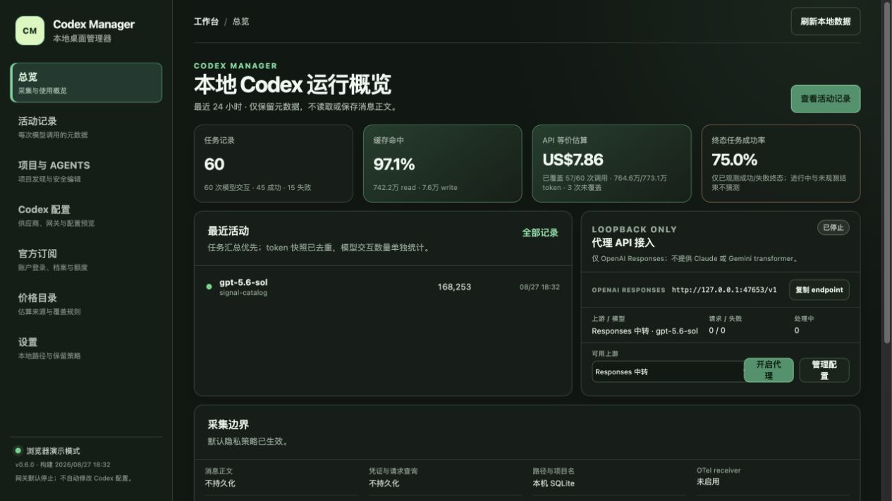

# Codex Manager

[English](README.md) | **简体中文**

> 你的本地 OpenAI Codex 控制中心。

Codex Manager 是一个非官方、本地优先的桌面应用，用于在本机统一了解和管理 Codex 使用情况：session、模型、推理等级、token、账户、供应商、项目和 `AGENTS.md`。

[](https://github.com/ewsun22/codex-manager/releases/latest) [](https://github.com/ewsun22/codex-manager/actions/workflows/ci.yml) [](https://github.com/ewsun22/codex-manager/releases/latest) [](https://tauri.app/) [](https://www.rust-lang.org/) [](LICENSE)

**[下载 macOS 版（Apple 芯片）→](https://github.com/ewsun22/codex-manager/releases/latest)**



## 下载

**[下载最新签名 macOS 正式版](https://github.com/ewsun22/codex-manager/releases/latest)** · [Release 资产与校验和](https://github.com/ewsun22/codex-manager/releases/latest) · [全部 Releases](https://github.com/ewsun22/codex-manager/releases)

最新的非 draft、非 prerelease GitHub Release 是稳定 macOS arm64 下载的唯一事实来源。每个版本都必须独立通过 Developer ID 签名、Apple 公证、stapling 和公开资产复验；若流程要求完整核验，请在安装前检查该版本的资产和校验和。

如果 Codex Manager 能改善你的工作流，欢迎为仓库点 Star 以关注后续版本。

## 为什么需要 Codex Manager？

随着 Codex 使用变复杂，有价值的信息分散在 CLI、本地 rollout 文件、配置、账户状态和项目说明中。用户很难快速回答某个任务使用了什么模型和 reasoning effort、观察到了多少 token、哪些项目有 `AGENTS.md`，以及当前使用哪个账户或供应商。

Codex Manager 将这些视图集中到一个本地桌面控制中心，同时明确数据边界：数据标注来源，缺失值保持 `unavailable`，估算不会伪装成供应商账单。

## 核心功能

### 观测

- 浏览 session、turn、模型交互、模型、供应商、reasoning effort、耗时和 token 分类。
- 查看 input、output、cached read/write、reasoning output token 及来源/provenance。
- 活动筛选、游标分页和详情查看；不持久化消息正文或 reasoning 文本。
- 按版本化价格目录估算 API 等价成本；不是 ChatGPT 订阅扣费或供应商账单。
- 总览使用紧凑布局，最近活动默认只显示一条；首页 API 等价估算显示两位小数，底层覆盖口径不变。

### 管理

- 增量读取本地 `sessions` 与 `archived_sessions`，规范化到 SQLite。
- 发现已观测项目、Git root、worktree 和有效的 `AGENTS.md` 链。
- 只在明确授权根目录内创建、编辑、保存、恢复和查看 `AGENTS.md` revision。
- 通过官方 Codex login/App Server 边界查看账户、套餐、额度窗口和重置时间；macOS beta 支持多个 OAuth profile 及明确切换。
- 官方订阅首次成功读取后优先使用本地白名单缓存；用户可点击“刷新”强制重新读取，界面明确标注缓存时间和上次确认状态。
- 使用独立的“Codex 配置”页面，在官方直连、本地 CLIProxyAPI、已保存的外部 Responses 兼容供应商之间切换，并支持预览、CAS/原子应用和恢复。
- 使用独立的“本地代理”页面，导入并管理 CLIProxyAPI OAuth 档案或外部 API Key 上游，再把本机 loopback 接入配置给 Codex。

### 本地优先

- 默认使用本机 SQLite；没有产品遥测或云同步。
- 官方与 CLIProxyAPI OAuth secret 分别保存在隔离的应用专用 Keychain；供应商 API Key 静态保存在 Keychain，仅在内核运行期间写入权限为 `0600` 的应用私有运行文件。
- 可选 OTel receiver 和 CLIProxyAPI 内核在用户开启前均停止，并只绑定本地接口。
- 不会静默改写 Codex 配置或后台换号。

## 快速开始

1. 从 [Releases](https://github.com/ewsun22/codex-manager/releases/latest) 下载最新 macOS `.dmg`。
2. 安装并启动 **Codex Manager**。
3. 首次启动时，应用会在配置的 Codex home（通常为 `~/.codex`）下发现本地数据。
4. 打开活动页面查看已观测的 session 和模型使用情况。
5. 编辑 `AGENTS.md` 前先在设置中授权项目根目录；使用反代前先保存供应商，再在首页显式开启。首次开启会下载并校验当前平台的 CLIProxyAPI 官方预编译发行包；Codex Manager 不在本机编译 Go 内核。

Codex 配置应用需要用户明确确认；不会改写 `auth.json`。正式签名版本已完成 Developer ID signing、Apple notarization 和 stapling。

## 截图

所有截图均使用人工构造且已脱敏的演示数据。

| 活动与 token 用量 | 账户与额度 |
| --- | --- |
|  |  |

| 项目与 `AGENTS.md` | 自定义 Responses 供应商 |
| --- | --- |
|  |  |

## 平台支持

- **已支持：** macOS 13+，当前发布资产为 arm64。
- **Windows：** unavailable；不宣称已有等价 secret store 和文件安全实现。
- **Linux：** unavailable；不宣称已有等价 secret store 和文件安全实现。

核心采集、规范化、存储、价格和项目解析保留跨平台接口，但不代表当前支持 Windows 或 Linux。

## 工作方式

- **Rollout adapter：** 增量读取本地 `sessions` 和 `archived_sessions` JSONL，只记录元数据。token 快照按 session、ordinal、事件类型和累计向量去重。
- **OTel adapter：** 可选的本地 TLS loopback、认证 OTLP/HTTP，可提供请求状态、耗时和有限分类；不会猜测性拼接 metrics 与 session。
- **CLI Schema 兼容性：** 通过短生命周期探测确认本机 CLI 是否支持 App Server Schema；这是非采集源，不附着 Codex Desktop 私有 stdio，也不影响 rollout 主采集。最近探测结果会持久化。
- **官方 App Server adapter：** 以独立短生命周期读取账户、套餐和 ChatGPT Codex 额度；不附着 Codex Desktop 私有 stdio，也不读取历史数据。
- **Filesystem 与 AGENTS adapter：** 发现已观测 cwd 和授权根目录，写入使用 canonical path、no-follow、冲突检查和原子替换保护。

## 可观测性与数据边界

`unavailable` 表示来源没有提供可验证字段，不是零值；`unobserved` 表示没有可靠终态，不等于成功、失败或仍在运行。Rollout JSONL 是内部兼容来源，不是稳定公开 API。OTel `codex.api_request` 可增加状态、耗时和固定分类，但不保存原始 host、path、query 或 body。当前 telemetry 通常不能可靠提供 wire response bytes 或请求级 TTFB，因此不宣称覆盖所有请求、严格实时完整性或完整供应商账单。

API 等价价格使用已识别模型调用和版本化本地价格目录；未知模型和字段不完整部分保持未覆盖。它不是 ChatGPT 套餐扣费、OpenAI Platform 账单或第三方供应商账单。详见[能力矩阵](docs/capability-matrix.md)和[架构说明](docs/architecture.md)。

## 账户、供应商与本地网关

官方订阅继续使用可信的 `codex login`、App Server、官方 credential store 和明确账户切换；官方 OAuth token 不会进入 CLIProxyAPI。三个信任域——Codex 配置编排、官方 Codex OAuth、CLIProxyAPI OAuth——只交换不透明档案 ID 和状态。可选反代改为独立版本的 [CLIProxyAPI](https://github.com/router-for-me/CLIProxyAPI) 预编译 sidecar，Codex Manager 不编译或嵌入其 Go 源码。

CLIProxyAPI 默认停止，生成配置强制绑定 `127.0.0.1`，关闭远程管理、控制面板、动态插件、usage statistics 与请求日志，并启用 `commercial-mode`。本地代理支持用户导入的 CLIProxyAPI OAuth 档案池（`codex`、`claude`、`antigravity`、`kimi`、`xai`）或一个外部 OpenAI-compatible API-key 上游。OAuth 文件只由原生选择器导入并存入独立 Keychain；Management API 与 OAuth callback 不向 WebView 开放。桌面主体与内核版本独立；安装校验和事务恢复规则保持不变。

当前预编译内核无法禁止上游 redirect 或锁定已验证 DNS/IP，因此任意自定义 Base URL 的 SSRF/DNS rebinding 边界不能继承原 Rust 网关。在上游或受信任架构层提供这些强制项前，该反代集成仍是未发布技术原型，不得进入正式发布。

API Key 静态保存在 Keychain；启动 sidecar 时才复制到应用私有运行配置。OAuth 档案投影到随机 `0700` auth-dir 与 `0600` 文件；正常停止前执行 provider/identity/CAS checkpoint 后再清理，崩溃 pending 证据会 fail closed，确认无 orphan 后才恢复。Codex 配置使用官方 `model_providers.<id>.auth.command`，仅保存 app binary path 与 allowlisted opaque secret ref；私有 journal 支持恢复并在文件漂移时拒绝覆盖。`verified` 只表示写后文件复核，不代表 Codex 已成功请求上游。

每次启动使用随机 runtime session，并在启动前确认 loopback 端口未被占用；正常停止会回收自己持有的 child 并删除 session。macOS 强制杀死主应用仍可能留下 sidecar，下一次启动会 fail closed，不会按名称或未验证 PID 广泛终止；跨重启 ownership/PID 安全恢复仍是发布阻断项。

官方订阅页面采用 cache-first：没有缓存时首次读取成功后，在 macOS 独立 Keychain 中保存包含 email 的白名单账户摘要、套餐、额度窗口和时间；后续进入页面先读取本地缓存，只有用户点击“刷新”才强制实时读取。快照超过 6 小时、刷新失败或尚未观测时必须明确显示“陈旧/上次确认/unavailable”，不以旧数据伪装实时状态；即使可信 CLI 暂时缺失，已有安全快照仍可离线显示。不保存 token、原始 JSON、授权 URL 或错误正文。

Codex 配置页面聚焦供应商、网关与配置预览，已移除未开放的“全局提示词”“插件与市场”“会话管理”占位模块。侧栏的“本地桌面模式”同时显示应用版本和构建时间（可选短 SHA）；构建时间来自构建元数据，不代表启动时间。

官方档案切换必须由用户明确触发，且仅在 Codex 最终解析的 `cli_auth_credentials_store` 为 `file` 时支持；`keyring` 和 `auto` 模式会 fail closed。CLI 与 IDE 扩展共享活动凭据文件，切换前应先结束正在运行的 Codex 任务。CLIProxyAPI OAuth 档案属于独立信任域，不参与官方档案切换。

## 安全与隐私

- 默认本地优先：没有产品遥测、云同步或自动上传。
- 不持久化消息正文、prompt、reasoning 文本、tool 参数/结果、`Authorization`、Cookie、OAuth code、access/refresh token、完整环境变量、请求 query 或原始 OAuth/App Server 响应。唯一明确例外是 sidecar 运行期间所需的凭据会存在于 CLIProxyAPI 应用私有 `0600` 运行文件中。
- OAuth profile secret 在受限原生流程验证并存入应用专用 macOS Keychain；SQLite/WebView DTO 只暴露非秘密元数据。
- OTel 与 CLIProxyAPI listener 都需要用户显式开启并仅绑定本机；CLIProxyAPI 生成配置 fail closed，Management 与 OAuth 控制面不对本应用开放。
- AGENTS 写入要求授权根目录、canonical path、符号链接和外部修改检查及原子替换。
- Release CI 包含固定 action SHA、secret scan、SBOM/许可证、资产哈希和受保护签名流程。

详见 [SECURITY.md](SECURITY.md)、[PRIVACY.md](PRIVACY.md)、[供应链说明](docs/supply-chain.md)、[能力矩阵](docs/capability-matrix.md) 和 [架构说明](docs/architecture.md)。

## 发布状态

稳定通道指向最新的非 draft、非 prerelease macOS arm64 Release。源码版本、tag 或草稿存在都不等于已公开；每个版本必须完成 exact-SHA CI、受保护签名、草稿复验、人工 Publish 和 published-mode 复验。

- `implemented`：供应商管理、本地网关、官方订阅视图、更新器和文档已进入 tag 源码。
- `tested`：Release/复验 workflow、自动化测试、构建、签名、公证、stapling 和公开资产检查按发布证据通过。
- `published`：只有非 draft、非 prerelease 且完成 published-mode 复验的 GitHub Release 才属于稳定通道。
- `observed`：本地 mock/loopback、桌面/浏览器 demo 和公开 Release 复验已有证据。
- `accepted`：真实 OAuth/API Key 上游 E2E、费用确认、事务性配置应用/恢复，以及从可信旧签名应用升级安装仍是独立验收工作。
- `cleanup`：Release job 会在上传前删除临时签名材料；本地测试凭据/配置仍需操作者清理。

各版本的 source SHA、workflow、资产和验收限制见[发布运行手册](docs/release.md)。版本化 note 保留 tag 时的门禁快照，后续公开复验证据单独记录。早期 `v0.5.0-beta.1` 仍是 unsigned community prerelease，不是稳定下载。

## 开发

要求：Node.js 24+、Rust 1.98.0，桌面目标需要 macOS 13+。

```bash
npm ci
npm run typecheck
npm test
cargo test --workspace
npm run tauri:dev
```

详见 [docs/development-plan.md](docs/development-plan.md) 和 [docs/validation-2026-08-27.md](docs/validation-2026-08-27.md)。浏览器 demo 使用人工构造的脱敏数据，不会自动联网。

## 文档

- [能力矩阵](docs/capability-matrix.md) — 来源、字段、provenance 和不支持的宣称
- [架构说明](docs/architecture.md) — adapter、存储、去重和状态边界
- [开发计划](docs/development-plan.md) — 当前范围和后续工作
- [发布运行手册](docs/release.md) — 签名发布、复验、回滚和 cleanup 边界
- [安全策略](SECURITY.md) 与 [隐私说明](PRIVACY.md)

## 许可证

Codex Manager 使用 [Apache License 2.0](LICENSE) 发布。依赖和参考说明见 [THIRD_PARTY_NOTICES.md](THIRD_PARTY_NOTICES.md)。

## 免责声明

Codex Manager 是非官方社区项目。**与 OpenAI 无隶属或背书关系。** OpenAI、Codex 及相关标志归其各自所有者所有。请自行承担账户、供应商、配置和本地文件功能的使用责任，并遵守所连接服务的条款和隐私政策。
