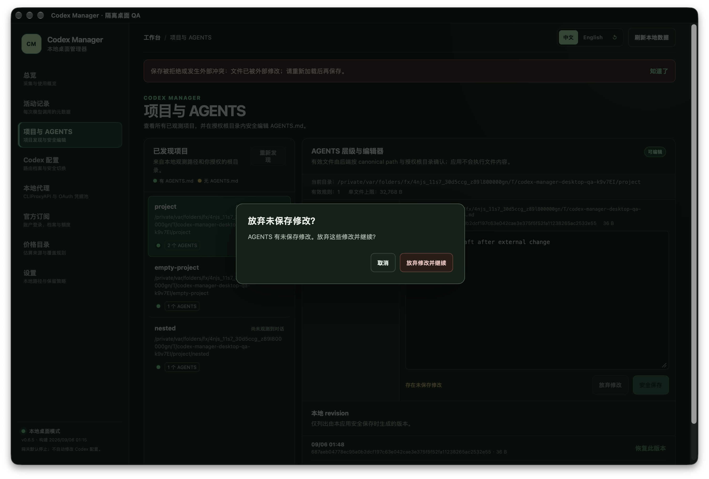

# S5–S6 可靠性验证记录

日期：2026-09-06。继 [S1–S4](reliability-s1-s4.md) 的 `0f4d9ed8122c1d2041ae4dbfb9b985f3b848f961` 源码提交与成功 CI 后，本切片完成扫描调度优化、文档自动检查及隔离桌面/内核验证。当前产品版本仍为 `0.6.5`，本记录不改变该稳定 tag 的功能事实。

## S5 扫描行为与基准

变更文件经 watcher 进入有界 dirty 队列，历史发现使用可续接的 WalkDir 游标；续读与历史发现按配额交替，持续事件不能饿死 reconciliation。dirty 与 continuation 队列各最多 1,024 项，发现每轮最多 4,096 项或 100ms，深度最多 16；保留原读取、文件身份、checkpoint、字节/事件/轮次预算。周期 reconciliation 使用独立单调时钟，每 60 秒触发；pending 工作每 250ms 继续。

冷启动仍先扫描 `sessions` 再扫描归档，但不再承诺全局 mtime 降序。未开始历史游标时，刚被修改的文件可直接进入增量读取，不需要先收集并排序所有历史路径。

人工基准在 macOS aarch64 debug 构建、暖缓存下每规模执行 5 次：N−1 个空历史文件和 1 个具有真实 JSONL 增量的人工文件，经过实际 safe_fs 与 SQLite checkpoint。下表是事件到达扫描器后至目标 checkpoint 提交的时间，不含 watcher debounce、UI 刷新或真实历史正文解析。

| 历史文件数 | 旧 p50 / ms | 新 p50 / ms | 旧 p95 / ms | 新 p95 / ms |
| --- | ---: | ---: | ---: | ---: |
| 1,000 | 3.959 | 1.115 | 4.492 | 1.226 |
| 10,000 | 36.815 | 1.022 | 38.346 | 1.119 |
| 50,000 | 215.017 | 1.037 | 415.992 | 1.165 |

旧实现仍会完成全目录检查，50k 整轮 p50 为 6,698.816ms；新实现该变更轮只检查 1 个文件，发现 0 个目录项。不能把这个人工场景外推为所有真实目录的固定倍数提升。原始 30 个样本见 [benchmark JSON](scanner-benchmark-2026-09-06.json)。

## S6 真实桌面与确认框

本机 macOS WebView 的 `window.confirm` 不能承担可靠的批准流程；冷启动真实桌面验证暴露了这一问题。本切片统一改为应用内 HTML dialog，覆盖未保存离开、AGENTS 创建/恢复、Codex 配置应用/恢复/删除、外部供应商删除和本地代理 OAuth 档案移除。批准与操作目标绑定，重复请求立即拒绝，取消或页面卸载不会执行待确认写入；已有 Rust 原生确认仍保留。

显式 `desktop-qa` debug feature 构造新的私有人工目录、SQLite v13 数据和 60 条 rollout，再走真实迁移 14、采集、WebView 和 Tauri IPC。账户、配置写入、代理、updater、设置修改及 CLI probe 不注册 handler；认证 backend 禁用，WebView 使用非持久 store。默认产品入口不启用此 feature，关闭 debug assertions 的构建会按预期拒绝 QA feature。

最终冷启动通过以下 8 项：

1. 14 个不在 QA 范围内的命令均被拒绝。
2. 首屏 50 条以外的第 60 条稀有模型，能在真实 SQLite 筛选候选中选取并显示。
3. AGENTS 经真实 UI 安全保存，磁盘读回内容和 SHA 变化一致。
4. 恢复对话框取消不写盘，确认后恢复 revision 捕获的保存前内容。
5. 创建对话框取消不生成文件，确认后文件可由 native open 和有效链读回。
6. 外部编辑后保存触发 CAS 冲突，外部内容和未保存草稿均保留。
7. 主导航取消保持原页面和草稿。
8. 原生关闭触发真实对话框，取消后窗口和草稿保留。

随后按精确 QA PID 和窗口标题定位，真实点击窗口关闭按钮，检查下方截图，再点击“放弃修改并继续”。native `Destroyed` 事件记录为 true，QA 进程正常退出。结果见 [桌面 JSON](desktop-qa-2026-09-06.json)。

此外 Chrome 人工 demo 对配置应用、恢复、删除配置、删除外部供应商、代理 OAuth 档案移除共 5 个动作，逐一验证取消保持、确认点击一次及显式刷新读回，全部通过。一次标签页读取中断后先核实既有成功状态，没有重复移除；见 [确认框 demo 记录](confirmation-demo-2026-09-06.json)。确认期间只禁用后台控件，不虚报扫描或保存进行中。

截图来自实际运行的人工数据窗口，不是生成或拼接图。该证据不包含真实 OAuth、用户 Codex 配置或 updater 安装。

早期验证曾用 System Events 的同名进程引用误关已安装应用窗口，已立即重新打开；之后所有原生操作改为精确 PID + QA 标题定位。没有由此执行真实账户或配置写入。一次开发 HMR 因修改 hook 顺序导致刷新失败，最终记录采用代码冻结后的冷启动结果，不沿用被打断的会话作为最终验收。

## 审核版 CLIProxyAPI 实际观测

执行既有显式 ignored 的下载/安装测试，经生产安装器下载官方 `v7.2.145` darwin_aarch64 资产并校验固定 SHA-256：`c711728ab6f340c69ea322544970fc2b137816adba501438d57670365c8e513d`。macOS 分支随后使用生产配置、健康和停止流程，随机本机 client key、空 OAuth auth-dir、隔离环境和人工请求进行观测：

| 检查 | 实际结果 |
| --- | --- |
| 健康检查 | 200 |
| 无认证 models | 401 |
| 认证 models | 200 |
| 禁用 management / control panel | 404 / 404 |
| 空凭据池请求 / malformed 请求 | 400 / 400 |
| socket | lsof 只发现 IPv4 loopback listener |
| 落盘正文检查 | 检查 7 个文件，未出现唯一人工请求标记 |
| 停止 | runtime 删除，端口释放 |

本次没有上游凭据，未发起计费调用，没有得到成功 Responses 或 5xx；不能把上述 4xx 和空池证据外推为真实 OAuth checkpoint、成功用量或所有错误路径的验收。

## 自动检查与复现

- `npm test`：125 项通过；`npm run typecheck`、`npm run build` 通过。
- `cargo test --offline --workspace`：148 项通过，4 项显式 ignored；scanner 定向测试 11 项通过，人工基准另行执行通过。
- `cargo test --offline -p codex-manager-desktop official_release_download_and_extract_uses_the_real_installer -- --ignored --nocapture`：1 项真实下载、安装及空池观测通过。
- `cargo test --offline -p codex-manager-desktop benchmark_changed_file_scanning_against_legacy_full_scans -- --ignored --nocapture`：1 项人工规模基准通过。
- `cargo test --offline -p codex-manager-desktop --features desktop-qa artificial_desktop_state_migrates_and_keeps_rare_model_beyond_first_page`：人工迁移与跨页 fixture 通过。
- `cargo fmt --all -- --check`、默认工作区 Clippy 与 `cargo clippy --offline -p codex-manager-desktop --features desktop-qa --all-targets -- -D warnings` 通过。
- `cargo rustc --offline -p codex-manager-desktop --features desktop-qa -- -C debug-assertions=no`：按预期失败，诊断为 `desktop-qa is only available in debug builds`。
- `CODEX_MANAGER_QA_AUTORUN=1 npm run tauri:dev -- --features desktop-qa --no-watch`：启动上述隔离桌面。自动检查后保留窗口，需检查画面并通过真实按钮完成允许关闭验证。

文档检查范围、离线/联网区别和解析限制见 [文档自动检查](../documentation-checks.md)。推送前检查已通过：30 份文档、14 个 release note、115 个链接及外部 URL；双语版本、平台与下载入口一致。两份 README、本文、未发布 note 和文档检查说明经 GitHub GFM 渲染成功，标题、表格和图片链接结构已核对。

## 用户可见面同步

- README 双语功能事实、当前源码说明和验证入口同步更新；架构、能力矩阵、开发计划、安全/隐私/供应链与未发布 note 同步。
- 截图：新增隔离桌面验证截图；现有稳定版本首页截图 no change，因为没有重做稳定发布或覆盖稳定版本说明。
- Release 正文与 `latest.json.notes`：no change，本切片仅源码推送，不创建新版本或发布资产；`unreleased` 是准确状态，不能机械删除。
- GitHub Description / Topics、下载链接、徽章、平台与版本入口：no change，产品定位和支持平台未变，稳定下载仍为 `v0.6.5`。
- 网站或商店：no change，本项目没有因本次源码改动新增部署入口。

## 状态、回退与清理

`implemented` / `tested`：S5、本地 S6 和上列独立观测已完成。`published`：没有新 tag、签名、Release 或 updater 目标。`accepted`：隔离人工业务路径通过；真实 OAuth 业务链未验收。updater 按用户明确要求 `skipped by user`，不属于本轮完成条件，详情见 [真实验收边界](real-e2e-boundaries.md)。

源码可通过普通 revert 回退本切片；没有执行真实用户数据库迁移或配置写入，不需要回退用户配置。人工目录仅包含 fixture 与验证证据；记录会保留本地，实际进程和临时 listener 已关闭。仓库已有未跟踪 `design-qa.md` 保留，不纳入提交。

`deployment_decision=none`：授权覆盖源码提交、推送和继续 S5–S6，本次不签名、不发布、不部署；真实账户、计费请求和配置切换仍需明确对象与费用边界。
